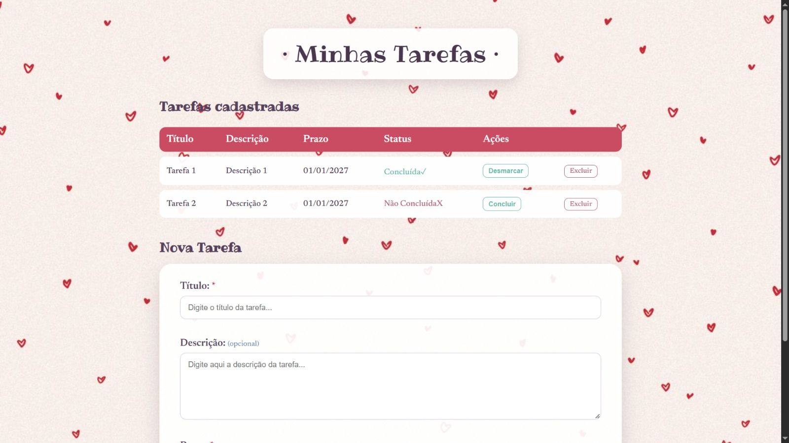
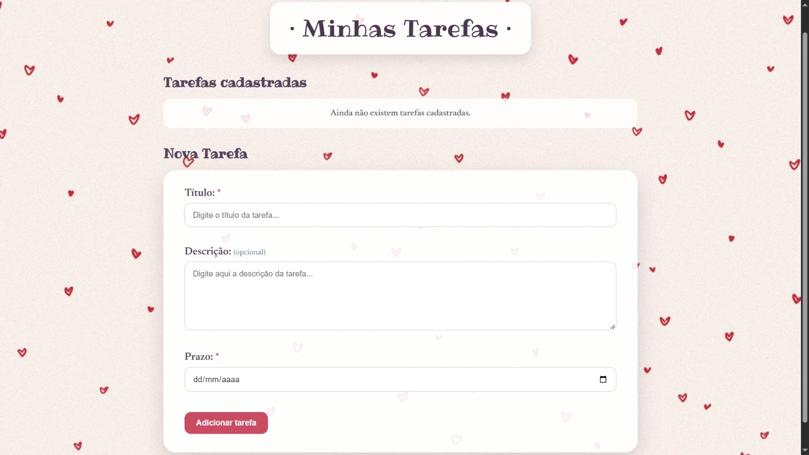

# 📋 Sistema de Gestão de Tarefas

> Aplicação web para gerenciamento de tarefas, desenvolvida com **Java, Spring Boot, Thymeleaf, Spring Data JPA e SQLite**, aplicando o padrão arquitetural MVC.


---

## 📖 Sobre o projeto

O **Sistema de Gestão de Tarefas** é uma aplicação web desenvolvida como parte da disciplina de **Laboratório de Programação da Universidade Estadual de Londrina (UEL)**.

O sistema tem como objetivo permitir o gerenciamento de tarefas por meio de uma interface web, possibilitando o cadastro e a visualização das informações armazenadas.

A aplicação foi desenvolvida utilizando **Spring Boot** e segue o padrão arquitetural **MVC (Model-View-Controller)**, separando as responsabilidades entre os dados da aplicação, o processamento das requisições e a camada de apresentação.

Os dados são persistidos em um banco de dados **SQLite**, utilizando **Spring Data JPA e Hibernate** para o mapeamento objeto-relacional.

### 🎯 Objetivos técnicos

Durante o desenvolvimento, foram trabalhados conceitos como:

- Desenvolvimento de aplicações web com Java;
- Arquitetura MVC;
- Spring Boot;
- Injeção de dependências;
- Spring Data JPA;
- Mapeamento objeto-relacional (ORM);
- Persistência de dados em banco relacional;
- Desenvolvimento de interfaces com Thymeleaf;
- Validação de dados no lado do servidor;
- Manipulação de requisições HTTP.

---

## 🎨 Layout / Demonstração

> As imagens abaixo podem ser substituídas por capturas de tela da aplicação após sua finalização.

### Tela principal

<div align="center">
    
</div>

### Cadastro de tarefa

<div align="center">
    
</div>

---

## ✨ Funcionalidades

- [x] Cadastro de tarefas
- [x] Listagem de tarefas
- [x] Persistência das tarefas em banco de dados
- [x] Formulário integrado ao objeto `Tarefa`
- [x] Integração entre Controller, Repository e banco de dados
- [x] Interface web utilizando Thymeleaf
- [ ] Edição de tarefas
- [x] Exclusão de tarefas
- [x] Marcação/desmarcação de tarefas como concluídas
- [x] Validações completas do formulário
- [x] Exibição de mensagens de erro de validação

> As funcionalidades marcadas como pendentes correspondem às etapas ainda não implementadas na versão documentada deste projeto.

---

## 🛠️ Tecnologias utilizadas

### Linguagem

- **Java 25**

### Framework e bibliotecas

- **Spring Boot**
- **Spring Web**
- **Spring Data JPA**
- **Hibernate**
- **Thymeleaf**
- **Bean Validation**
- **Maven**

### Banco de dados

- **SQLite**
- **SQLite JDBC Driver**

### Ferramentas

- **Visual Studio Code**
- **Git / GitHub**
- **Maven Wrapper**

---

## 🏗️ Arquitetura

A aplicação utiliza o padrão **MVC (Model-View-Controller)** para organizar suas responsabilidades.

```text
                    ┌──────────────────┐
                    │      Usuário     │
                    └────────┬─────────┘
                             │
                             ▼
                    ┌──────────────────┐
                    │      View        │
                    │    Thymeleaf     │
                    └────────┬─────────┘
                             │
                             ▼
                    ┌──────────────────┐
                    │    Controller    │
                    │ TarefaController │
                    └────────┬─────────┘
                             │
                             ▼
                    ┌──────────────────┐
                    │    Repository    │
                    │ TarefaRepository │
                    └────────┬─────────┘
                             │
                             ▼
                    ┌──────────────────┐
                    │      SQLite      │
                    │    tarefas.db    │
                    └──────────────────┘
```

### Model

A camada **Model** representa os dados utilizados pela aplicação.

Neste projeto, a entidade principal é a classe `Tarefa`, que representa uma tarefa armazenada no banco de dados.

Ela possui os seguintes atributos:

| Atributo    | Tipo        | Descrição                        |
| ----------- | ----------- | -------------------------------- |
| `id`        | `Long`      | Identificador da tarefa          |
| `titulo`    | `String`    | Título da tarefa                 |
| `descricao` | `String`    | Descrição da tarefa              |
| `concluida` | `boolean`   | Indica se a tarefa foi concluída |
| `prazo`     | `LocalDate` | Prazo da tarefa                  |

A classe é mapeada como uma entidade JPA por meio da anotação `@Entity`.

### View

A camada **View** é responsável pela interface apresentada ao usuário.

A aplicação utiliza **Thymeleaf** para gerar as páginas HTML dinamicamente.

A principal página da aplicação está localizada em:

```text
src/main/resources/templates/tarefas.html
```

O Thymeleaf permite associar os elementos HTML aos objetos Java recebidos pelo Controller utilizando atributos como:

```html
th:object
th:field
th:each
th:text
```

### Controller

A classe `TarefaController` é responsável por receber as requisições HTTP e coordenar o fluxo da aplicação.

Entre suas responsabilidades está:

- receber a requisição do usuário;
- acessar o Repository;
- recuperar ou salvar tarefas;
- disponibilizar dados para a View;
- determinar qual página deve ser apresentada.

### Repository

A persistência é realizada por meio da interface:

```text
TarefaRepository
```

Ela estende:

```java
CrudRepository<Tarefa, Long>
```

Com isso, o Spring Data fornece operações de persistência sem que seja necessário implementar manualmente as consultas básicas ao banco.

---

## 📂 Estrutura do projeto

```text
Prova1LeticiaVideira/
│
├── src/
│   ├── main/
│   │   ├── java/
│   │   │   └── br/
│   │   │       └── uel/
│   │   │           ├── model/
│   │   │           │   └── Tarefa.java
│   │   │           │
│   │   │           ├── repository/
│   │   │           │   └── TarefaRepository.java
│   │   │           │
│   │   │           ├── controller/
│   │   │           │   └── TarefaController.java
│   │   │           │
│   │   │           └── Prova1LeticiaVideiraApplication.java
│   │   │
│   │   └── resources/
│   │       ├── templates/
│   │       │   └── tarefas.html
│   │       │
│   │       └── application.properties
│   │
│   ├── test/
│   │
│   └── ...
│
├── tarefas.db
├── pom.xml
├── mvnw
├── mvnw.cmd
└── README.md
```

---

## 🗄️ Banco de dados

A aplicação utiliza **SQLite** para armazenar os dados das tarefas.

Diferentemente de um servidor de banco de dados tradicional, o SQLite armazena as informações em um arquivo local:

```text
tarefas.db
```

A conexão é configurada no arquivo:

```text
src/main/resources/application.properties
```

A aplicação utiliza:

```properties
spring.datasource.url=jdbc:sqlite:tarefas.db
spring.datasource.driver-class-name=org.sqlite.JDBC
spring.jpa.database-platform=org.hibernate.community.dialect.SQLiteDialect
spring.jpa.hibernate.ddl-auto=update
```

O **Hibernate/JPA** é responsável pelo mapeamento entre a classe Java `Tarefa` e a estrutura persistida no banco.

### Modelo de dados

A entidade `Tarefa` representa os dados armazenados:

```text
Tarefa
├── id
├── titulo
├── descricao
├── concluida
└── prazo
```

O identificador é gerenciado pelo banco utilizando geração automática de ID.

---

## 🔄 Fluxo de cadastro

O cadastro de uma tarefa segue o seguinte fluxo:

```text
Usuário
   │
   │ Preenche formulário
   ▼
tarefas.html
   │
   │ POST /tarefas
   ▼
TarefaController
   │
   │ @ModelAttribute
   ▼
Tarefa
   │
   │ save()
   ▼
TarefaRepository
   │
   ▼
SQLite
   │
   │
   ▼
redirect:/
   │
   ▼
Lista de tarefas
```

Esse fluxo permite que a interface fique desacoplada da lógica de persistência.

---

## 🌐 Rotas da aplicação

| Método | Rota       | Responsabilidade                            |
| ------ | ---------- | ------------------------------------------- |
| `GET`  | `/`        | Exibe a página principal e lista as tarefas |
| `POST` | `/tarefas` | Recebe e salva uma nova tarefa              |

A rota principal utiliza o método `findAll()` do Repository para recuperar as tarefas armazenadas e disponibilizá-las à View.

---

## 🚀 Como executar o projeto

### Pré-requisitos

Para executar a aplicação, é necessário ter instalado:

- **Java 25**
- **Git**
- **Maven** ou utilizar o Maven Wrapper incluído no projeto

O banco de dados utilizado é SQLite, portanto não é necessário instalar ou executar um servidor MySQL para utilizar a aplicação.

### 1. Clone o repositório

```bash
git clone <URL_DO_REPOSITORIO>
```

### 2. Entre na pasta do projeto

```bash
cd Prova1LeticiaVideira
```

### 3. Execute a aplicação

No Windows:

```bash
.\mvnw.cmd spring-boot:run
```

No Linux/macOS:

```bash
./mvnw spring-boot:run
```

### 4. Acesse a aplicação

Após a inicialização do Spring Boot, acesse:

```text
http://localhost:8080
```

---

## 📝 Como utilizar

### Cadastrar uma tarefa

1. Acesse a página inicial.
2. Preencha o título.
3. Opcionalmente, informe uma descrição.
4. Informe o prazo.
5. Envie o formulário.
6. A tarefa será persistida no banco de dados.

### Visualizar tarefas

As tarefas cadastradas são recuperadas do banco de dados por meio do `TarefaRepository` e apresentadas na tabela da página principal.

---

## 🧩 Principais classes

### `Tarefa.java`

Representa a entidade principal da aplicação.

Responsabilidades:

- representar uma tarefa;
- armazenar seus atributos;
- realizar o mapeamento entre o objeto Java e a entidade persistida.

### `TarefaRepository.java`

Responsável pela camada de acesso aos dados.

```java
public interface TarefaRepository
        extends CrudRepository<Tarefa, Long>
```

A utilização do `CrudRepository` permite que operações básicas de persistência sejam disponibilizadas pelo Spring Data.

### `TarefaController.java`

Responsável pelo processamento das requisições relacionadas às tarefas.

Entre as operações implementadas estão:

- exibição da página principal;
- recuperação das tarefas;
- recebimento de novas tarefas;
- persistência das informações.

### `tarefas.html`

Principal View da aplicação.

É responsável pela apresentação do formulário e da listagem das tarefas utilizando Thymeleaf.

---

## 📚 Conceitos aplicados

O projeto foi desenvolvido colocando em prática conceitos estudados durante a disciplina, principalmente:

- Programação Web com Java;
- Spring Framework;
- Spring Boot;
- arquitetura MVC;
- HTTP;
- Controllers;
- Injeção de Dependências;
- Thymeleaf;
- Spring Data JPA;
- ORM;
- persistência em banco de dados;
- SQLite;
- Maven;
- desenvolvimento de aplicações web.

---

## 🎓 Contexto acadêmico

Projeto desenvolvido para a disciplina de **Laboratório de Programação — Universidade Estadual de Londrina (UEL)**.

O enunciado propõe o desenvolvimento de um sistema web de gerenciamento de tarefas utilizando **Spring Framework, Thymeleaf, banco de dados relacional e arquitetura MVC**.

A estrutura adotada neste projeto utiliza SQLite como banco de dados, com persistência realizada através de JPA/Hibernate.

---

## 📖 Referências

- Documentação e materiais disponibilizados na disciplina de Laboratório de Programação.
- Material didático sobre desenvolvimento de aplicações web com Spring Framework e banco de dados.
- Documentação do Spring Framework.
- Documentação do Spring Data JPA.
- Documentação do Thymeleaf.
- Documentação do SQLite.

---

## 👩‍💻 Autora

**Letícia Videira Gois**

Estudante de Ciência da Computação — Universidade Estadual de Londrina (UEL)
